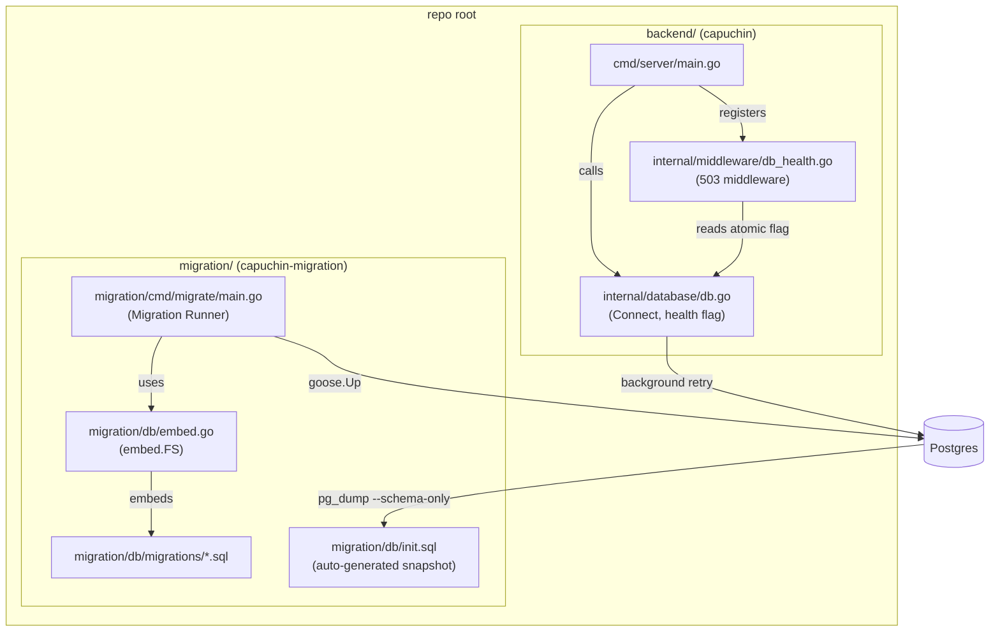
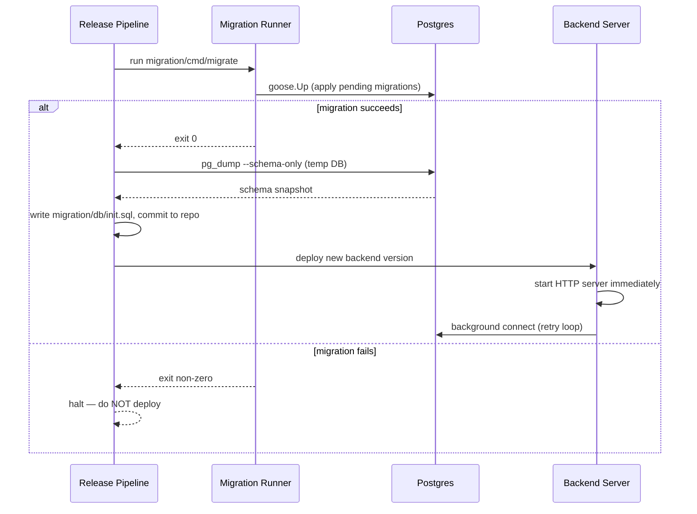
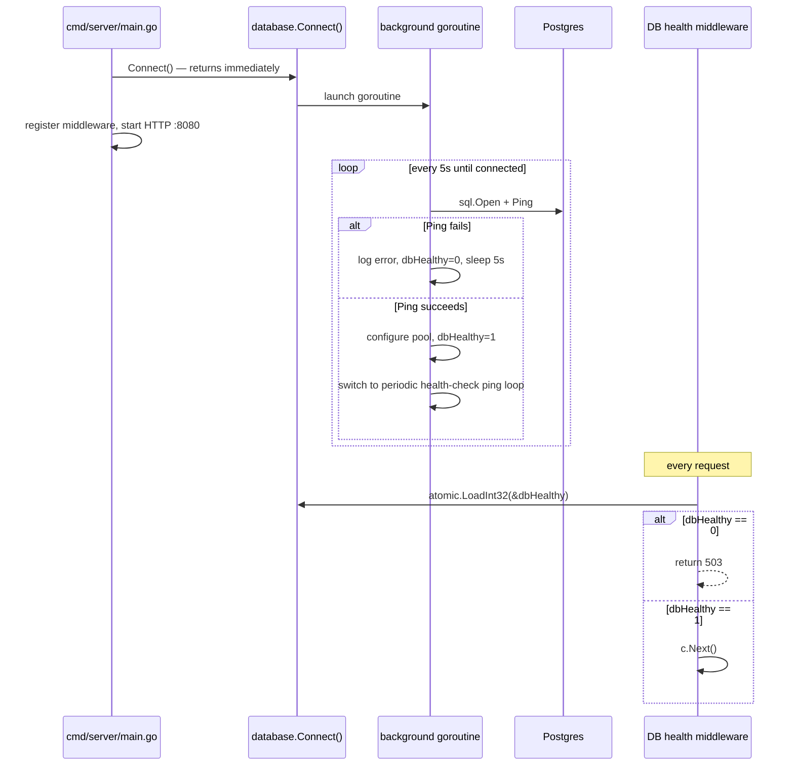

# Design Document: Migration Module Separation

## Overview

This design separates all database migration concerns from the `capuchin` backend module into a standalone Go module at `migration/`. The backend module is stripped of goose, testcontainers, and rapid dependencies. The backend server process becomes fully independent of Postgres availability: it starts immediately, retries the DB connection in the background, and returns HTTP 503 to callers while the database is unreachable.

The two modules share no Go import relationship. The migration module is a self-contained binary that reads connection parameters from environment variables, applies goose migrations, and exits. The backend module only knows how to open a `*sql.DB` and check whether it is healthy.

### Key Design Decisions

- **No shared module**: `migration/` has its own `go.mod` (`module capuchin-migration`). Zero imports from `capuchin`.
- **Non-blocking Connect()**: `database.Connect()` returns immediately; a background goroutine owns the retry loop.
- **Atomic health flag**: `sync/atomic` guards the `dbHealthy` boolean — no mutex needed for a single boolean.
- **503 middleware**: A single Gin middleware checks the health flag before any handler runs.
- **Fixed retry interval**: 5-second fixed interval keeps the implementation simple and predictable.

---

## Architecture



### Release Pipeline Flow



### Backend Startup Flow



---

## Components and Interfaces

### Migration Module (`capuchin-migration`)

#### `migration/db/embed.go`
```go
package db

import "embed"

//go:embed migrations/*.sql
var Migrations embed.FS
```

#### `migration/cmd/migrate/main.go`
Reads env vars directly (no `capuchin/internal/config` import). Calls `goose.Up` and exits.

```go
// Env vars consumed: POSTGRES_HOST, POSTGRES_USER, POSTGRES_PASSWORD,
//                    POSTGRES_DB, POSTGRES_PORT (default 5432)
func main() { ... }
```

#### `migration/` test package
Contains all six property-based tests relocated from `backend/internal/database/migrate_test.go`. Imports `capuchin-migration/db` for the embedded FS.

---

#### `migration/db/init.sql` — auto-generated schema snapshot

`migration/db/init.sql` is a **derived artifact** — it is never hand-edited and must never be modified manually.

**What it is:** A full schema-only dump of the database after all goose migrations have been applied. It represents the current schema state as a single SQL file.

**How it is generated:**
1. The release pipeline spins up a temporary Postgres instance.
2. `goose up` is run against it, applying all migrations in `migration/db/migrations/`.
3. `pg_dump --schema-only` is executed against the temp DB.
4. The output is written to `migration/db/init.sql` and committed to the repository.

**When it is generated:** On every release, after `goose up` exits with code 0. It is never regenerated on backend restarts or ad-hoc runs.

**What it is used for:** Docker and local dev environments can mount or execute `init.sql` to bootstrap a fresh database instantly — no need to replay the full migration history. This is a convenience for fast environment setup only.

**What it is NOT:**
- Not the source of truth for schema changes — `migrations/*.sql` remain the authoritative source.
- Not safe to hand-edit — any manual change will be overwritten on the next release.
- Not used by the Migration Runner at runtime — `goose.Up` always drives schema changes from the migration files.

---

### Backend Module (`capuchin`)

#### `backend/internal/database/db.go` — revised interface

```go
// DB is the shared connection pool. Nil until the background goroutine
// successfully connects for the first time.
var DB *sql.DB

// dbHealthy is 1 when DB is reachable, 0 otherwise.
// Accessed only via sync/atomic.
var dbHealthy int32

// Connect launches a background goroutine that attempts to open and ping
// Postgres on a fixed 5-second interval. It returns immediately without
// blocking the caller. The HTTP server may start before the DB is ready.
func Connect(cfg config.AppConfig) { ... }

// IsHealthy reports whether the last DB ping succeeded.
func IsHealthy() bool { return atomic.LoadInt32(&dbHealthy) == 1 }
```

The `Connect` signature changes from `func Connect()` (reads global `config.Config`) to `func Connect(cfg config.AppConfig)` to make the dependency explicit and testable. The existing call site in `cmd/server/main.go` passes `config.Config`.

#### `backend/internal/middleware/db_health.go` — new file

```go
// DBHealthCheck returns a Gin middleware that responds 503 when the database
// is not reachable, preventing handlers from executing against a nil DB.
func DBHealthCheck() gin.HandlerFunc { ... }
```

This middleware is registered globally in `cmd/server/main.go` before route setup.

#### `backend/cmd/server/main.go` — updated call site

```go
database.Connect(config.Config)   // non-blocking
r.Use(middleware.DBHealthCheck()) // 503 guard
```

---

## Data Models

No new persistent data models are introduced. The separation is purely structural.

### Health State (in-process only)

| Field | Type | Description |
|---|---|---|
| `dbHealthy` | `int32` (atomic) | 1 = DB reachable, 0 = DB unreachable |
| `DB` | `*sql.DB` | Shared connection pool; nil until first successful connect |

### Migration Runner Env Vars

| Env Var | Required | Default | Description |
|---|---|---|---|
| `POSTGRES_HOST` | yes | — | Postgres hostname |
| `POSTGRES_USER` | yes | — | Postgres username |
| `POSTGRES_PASSWORD` | yes | — | Postgres password |
| `POSTGRES_DB` | yes | — | Database name |
| `POSTGRES_PORT` | no | `5432` | Postgres port |

---

## Correctness Properties

*A property is a characteristic or behavior that should hold true across all valid executions of a system — essentially, a formal statement about what the system should do. Properties serve as the bridge between human-readable specifications and machine-verifiable correctness guarantees.*

### Property 1: Migration file structural invariants

*For any* `.sql` file in `migration/db/migrations/`, the filename must have a zero-padded five-digit numeric prefix strictly greater than all preceding files, the file must contain both a `-- +goose Up` block and a `-- +goose Down` block, and any `CREATE TABLE` statement must use `CREATE TABLE IF NOT EXISTS`.

**Validates: Requirements 2.2, 2.3**

---

### Property 2: Migration application round-trip

*For any* fresh Postgres database, after `goose.Up` completes successfully, querying `goose_db_version` must return a row with `version_id = 1` and `is_applied = true`.

**Validates: Requirements 3.2**

---

### Property 3: Migration idempotency

*For any* database state where all migrations are already applied, invoking `goose.Up` again must produce no schema changes — the count of rows in `goose_db_version` must be identical before and after the second invocation.

**Validates: Requirements 3.2**

---

### Property 4: App server does not migrate

*For any* fresh database, calling `database.Connect()` (or setting `database.DB` directly as the server does) must not cause `goose_db_version` to exist — the app server must never invoke any migration function.

**Validates: Requirements 6.1, 6.2**

---

### Property 5: Seed runner idempotency

*For any* migrated database, running the seed inserts twice in sequence must produce the same row counts as running them once — no duplicate rows, no errors on the second run.

**Validates: Requirements 3.2** (seed is a migration-module concern)

---

### Property 6: Concurrent migration safety

*For any* two goroutines both calling `goose.Up` simultaneously against the same database, each migration version must appear in `goose_db_version` with `is_applied = true` exactly once.

**Validates: Requirements 3.2**

---

### Property 7: DB health flag reflects connection state

*For any* sequence of connect/disconnect events, `database.IsHealthy()` must return `true` if and only if the most recent `DB.Ping()` succeeded — the flag must never be stale relative to the last observed ping result.

**Validates: Requirements 6.4, 6.7**

---

### Property 8: 503 returned while unhealthy

*For any* HTTP request to a DB-dependent endpoint, if `database.IsHealthy()` returns `false` at the time the middleware runs, the response status code must be 503 and no handler logic must execute.

**Validates: Requirements 6.5**

---

### Property 9: init.sql schema matches goose migration end state

*For any* fresh Postgres database bootstrapped via `migration/db/init.sql` and any fresh Postgres database with all goose migrations applied via `goose up`, the two databases must have structurally identical schemas — every table, column, index, constraint, and sequence present in one must be present and identical in the other.

**Validates: Requirements 7.1, 7.3** (release pipeline correctness — the generated snapshot must faithfully represent the post-migration schema)

---

## Error Handling

### Migration Runner

| Condition | Behaviour |
|---|---|
| Missing required env var | `log.Fatal` with descriptive message, exit 1 |
| Postgres unreachable | `log.Fatal` with error, exit 1 |
| `goose.Up` returns error | `log.Fatal` with error, exit 1 |
| All migrations already applied | `goose.Up` is a no-op, exit 0 |

### Backend DB Connect

| Condition | Behaviour |
|---|---|
| `sql.Open` fails | Log error, set `dbHealthy=0`, retry after 5s |
| `DB.Ping()` fails | Log error, set `dbHealthy=0`, retry after 5s |
| Ping succeeds after failure | Set `dbHealthy=1`, log recovery, switch to health-check loop |
| DB goes down at runtime | Next ping fails → `dbHealthy=0`, retry loop resumes |

### DB Health Middleware

| Condition | Behaviour |
|---|---|
| `dbHealthy == 0` | Return `503 Service Unavailable` with JSON body `{"error":"database unavailable"}`, abort chain |
| `dbHealthy == 1` | Call `c.Next()` |

---

## Testing Strategy

### Migration Module Tests (property-based)

Uses `pgregory.net/rapid` for property-based testing and `testcontainers-go` for ephemeral Postgres instances. All six existing tests are relocated verbatim, with import paths updated from `capuchin/db` → `capuchin-migration/db` and `capuchin/internal/database` removed.

Each test runs a minimum of 100 rapid iterations.

| Test | Property | Type |
|---|---|---|
| `TestP1_MigrationFileStructuralInvariants` | Property 1 | Structural invariant |
| `TestP2_MigrationApplicationRoundTrip` | Property 2 | Round-trip |
| `TestP3_MigrationIdempotency` | Property 3 | Idempotency |
| `TestP4_AppServerDoesNotMigrate` | Property 4 | Invariant |
| `TestP5_SeedRunnerIdempotency` | Property 5 | Idempotency |
| `TestP6_ConcurrentMigrationSafety` | Property 6 | Concurrency |

### Backend Module Tests (unit + example-based)

After the separation, `go test ./...` inside `backend/` must pass without Docker or a running Postgres instance.

| Test | Property | Type |
|---|---|---|
| `TestDBHealthFlag_ReflectsConnectionState` | Property 7 | Unit — mock ping |
| `TestDBHealthMiddleware_Returns503WhenUnhealthy` | Property 8 | Unit — Gin test context |
| `TestDBHealthMiddleware_PassesWhenHealthy` | Property 8 (inverse) | Unit — Gin test context |

**Property test configuration:**
- Tag format: `Feature: migration-module-separation, Property {N}: {property_text}`
- Minimum 100 rapid iterations per property test (migration module)
- Backend unit tests use `net/http/httptest` and a mock `*sql.DB` (via `database/sql/driver` interface) — no real Postgres required

### Init SQL Sync Check (CI integration test)

A dedicated CI test verifies that `migration/db/init.sql` stays in sync with the goose migration end state. It runs as part of the migration module's test suite and requires Docker (testcontainers).

**Procedure:**
1. Spin up two ephemeral Postgres instances via testcontainers.
2. Apply `migration/db/init.sql` to the first instance (direct `psql` execution).
3. Run `goose up` against the second instance using the embedded migration FS.
4. Dump the schema of both instances with `pg_dump --schema-only`.
5. Diff the two dumps — the test fails if any structural difference is found.

**Test name:** `TestInitSQLMatchesMigrationEndState`

This test catches any case where `init.sql` was not regenerated after a new migration was added, or where it was accidentally hand-edited.
