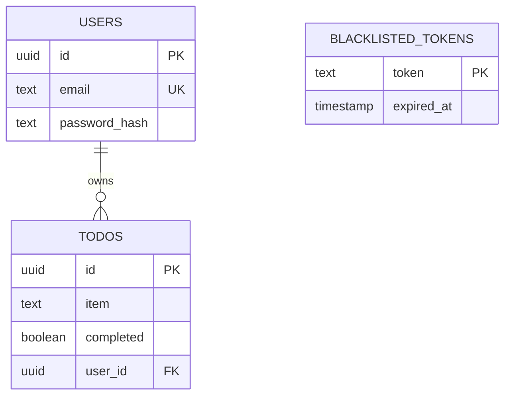

# Capuchin Backend Database Schema

This document outlines the data structures, tables, and relational constraints defined within the backend's PostgreSQL database. Schema changes are managed via **Goose**, a SQL-first migration tool.

---

## Migration Strategy

### Current: Goose (SQL migrations)

Schema lifecycle is managed by [Goose v3](https://github.com/pressly/goose). On every server startup, `database.Migrate()` is called, which runs any pending migrations in order and is a no-op if the schema is already up to date.

Migration files live in `backend/db/migrations/` and are embedded directly into the compiled binary via Go's `embed.FS`. This means no external files need to be mounted or copied at runtime — the binary is fully self-contained.

**Why Goose over golang-migrate:**
- golang-migrate is a pure migration runner with no Go library integration story — it's primarily a CLI tool. Embedding it cleanly into application startup requires more boilerplate and workarounds.
- Goose has a first-class Go library API (`goose.Up`, `goose.Down`, `goose.SetBaseFS`) designed to be called programmatically, which fits our startup-time migration pattern naturally.
- Goose supports both SQL and Go-based migrations in the same tool. If we ever need a data migration that can't be expressed in plain SQL (e.g., transforming encrypted fields, backfilling computed values), we can write it as a Go function without switching tools.
- Goose's migration file format (`-- +goose Up` / `-- +goose Down`) is explicit and readable, with no ambiguity about direction.
- golang-migrate's versioning uses timestamps or integers but has known edge cases with concurrent migration runs and dirty state handling that require manual intervention. Goose handles this more gracefully.

---

## Migration Files

| File | Description |
| :--- | :--- |
| `00001_init_schema.sql` | Initial schema — creates `users`, `todos`, and `blacklisted_tokens` tables |

---

## Tables Overview

The application uses three primary tables: `users`, `todos`, and `blacklisted_tokens`.

---

### 1. `users`
Stores all registered user accounts and their authentication data.

| Column | Type | Constraints | Description |
| :--- | :--- | :--- | :--- |
| `id` | `UUID` | `PRIMARY KEY` | Unique identifier generated on server during signup. |
| `email` | `TEXT` | `UNIQUE NOT NULL` | The user's email address. Uniqueness is enforced at the DB level to prevent race condition duplicate signups. |
| `password_hash` | `TEXT` | `NOT NULL` | The bcrypt-hashed representation of the user's password. Plain-text is never stored. |

---

### 2. `todos`
Stores the individual to-do list items, referencing their owning user.

| Column | Type | Constraints | Description |
| :--- | :--- | :--- | :--- |
| `id` | `UUID` | `PRIMARY KEY` | Unique identifier generated on server when todo is created. |
| `item` | `TEXT` | `NOT NULL` | The actual text content/task description. |
| `completed` | `BOOLEAN` | `DEFAULT FALSE` | Status flag denoting if the task is finished. |
| `user_id` | `UUID` | `REFERENCES users(id)` | Foreign key linking the item to its owner. Enforces data ownership and multi-tenancy rules at the database level. |

---

### 3. `blacklisted_tokens`
Stores JWT tokens that have been explicitly revoked by users logging out before the tokens' natural expiration time. This forms the backbone of the backend's stateless logout logic.

| Column | Type | Constraints | Description |
| :--- | :--- | :--- | :--- |
| `token` | `TEXT` | `PRIMARY KEY` | The raw JWT string that has been logged out. |
| `expired_at` | `TIMESTAMP` | `NOT NULL` | The exact time the token would have naturally expired. A backend goroutine runs hourly discarding any rows where `expired_at < time.Now()` to prevent database bloat. |

---

## Entity-Relationship Diagram (ERD)

### Future: Goose + Atlas (when migrations get heavy)

As the schema grows — more tables, frequent `ALTER TABLE` statements, index tuning, constraint changes — hand-writing migration SQL becomes error-prone. A missed column, wrong type, or forgotten index is easy to introduce and hard to catch before it hits production.

At that point we will layer in [Atlas](https://atlasgo.io) alongside Goose:

- Atlas inspects the actual database state and compares it against a desired schema definition. It computes the exact diff and generates the migration SQL automatically.
- Goose continues to own migration execution and versioning. Atlas only generates the files; Goose runs them.
- This separation of concerns is intentional: Atlas handles the "what changed" problem, Goose handles the "apply in order" problem.

**Genuine reasons to adopt Atlas later:**

1. **Diff-based generation eliminates human error.** When you have 20+ tables and need to add a nullable column with a default, rename a constraint, or add a partial index, writing that SQL by hand is risky. Atlas generates it correctly from a schema diff every time.
2. **Schema drift detection.** Atlas can compare your migration history against the live database and flag if someone applied a manual hotfix directly to the DB — a common source of production incidents.
3. **Declarative schema as source of truth.** You define what the schema *should* look like, not the steps to get there. This is easier to reason about as the schema grows.
4. **CI integration.** Atlas can lint migrations in CI, catching destructive operations (e.g., dropping a column with data) before they reach production.

**Why not Atlas alone (without Goose):**
Atlas can run migrations itself, but its execution model is less battle-tested in embedded Go startup scenarios compared to Goose. Goose's `embed.FS` integration and programmatic API are more mature for our use case. The combo gives us the best of both: Atlas for generation, Goose for execution.

---
