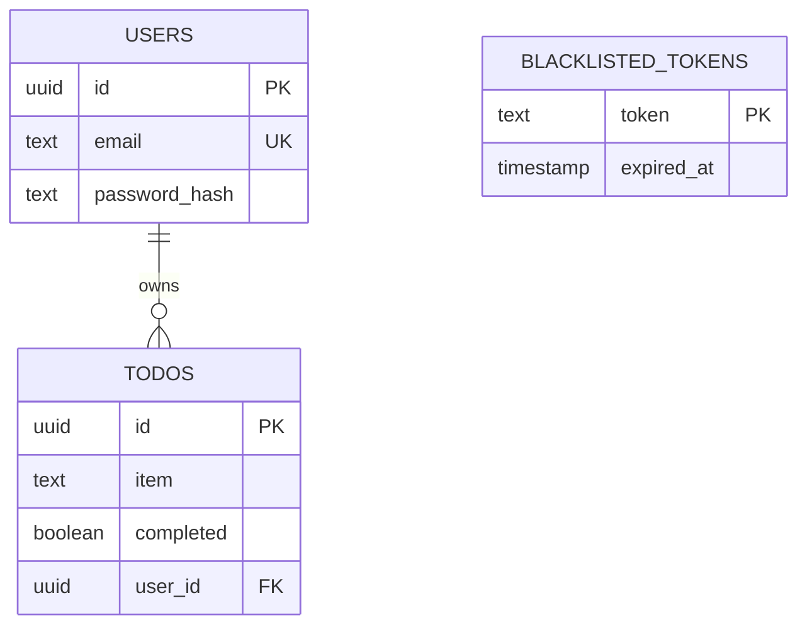

# Capuchin Backend Database Schema

This document outlines the data structures, tables, and relational constraints defined within the backend's PostgreSQL database. The schema is automatically initialized when the backend server boots via `database.InitSchema()`.

## Tables Overview

The application utilizes three primary tables: `users`, `todos`, and `blacklisted_tokens`.

---

### 1. `users`
Stores all registered user accounts and their authentication data.

| Column | Type | Constraints | Description |
| :--- | :--- | :--- | :--- |
| `id` | `UUID` | `PRIMARY KEY` | Unique identifier generated on server during signup. |
| `email` | `TEXT` | `UNIQUE NOT NULL` | The user's email address. Uniqueness is enforced at the DB level prevent race condition duplicate signups. |
| `password_hash` | `TEXT` | `NOT NULL` | The bcrypt-hashed representation of the user's password. Plain-text is never stored. |

---

### 2. `todos`
Stores the individual to-do list items, referencing their owning user.

| Column | Type | Constraints | Description |
| :--- | :--- | :--- | :--- |
| `id` | `UUID` | `PRIMARY KEY` | Unique identifier generated on server when todo is created. |
| `item` | `TEXT` | `NOT NULL` | The actual text content/task description. |
| `completed` | `BOOLEAN` | `DEFAULT FALSE` | Status flag denoting if the task is finished. |
| `user_id` | `UUID` | `REFERENCES users(id)` | **Foreign Key** linking the item to its owner. Enforces data ownership and multi-tenancy rules at the database level. |

---

### 3. `blacklisted_tokens`
Stores JWT tokens that have been explicitly revoked by users logging out before the tokens' natural expiration time. This forms the backbone of the backend's stateless logout logic.

| Column | Type | Constraints | Description |
| :--- | :--- | :--- | :--- |
| `token` | `TEXT` | `PRIMARY KEY` | The raw JWT string that has been logged out. |
| `expired_at` | `TIMESTAMP` | `NOT NULL` | The exact time the token would have naturally expired. A backend goroutine runs hourly discarding any rows where `expired_at < time.Now()` to prevent database bloat. |

---

## Entity-Relationship Diagram (ERD)

